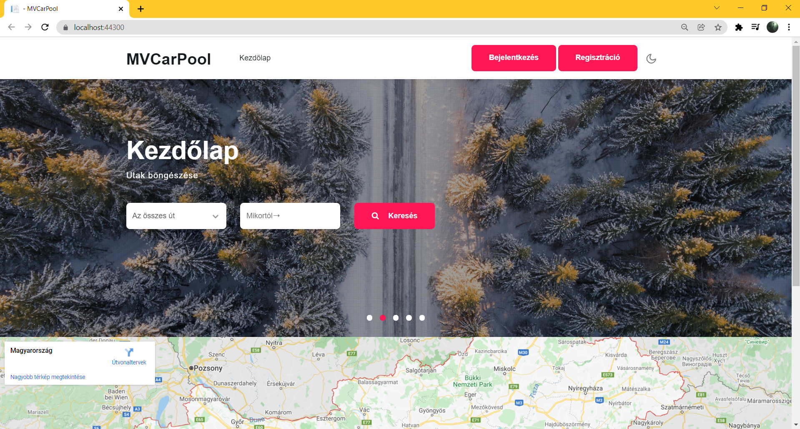
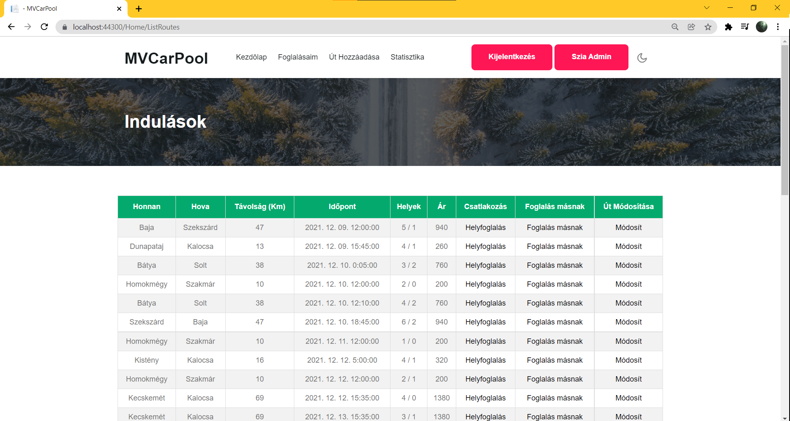
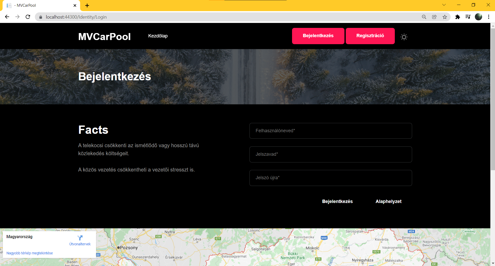
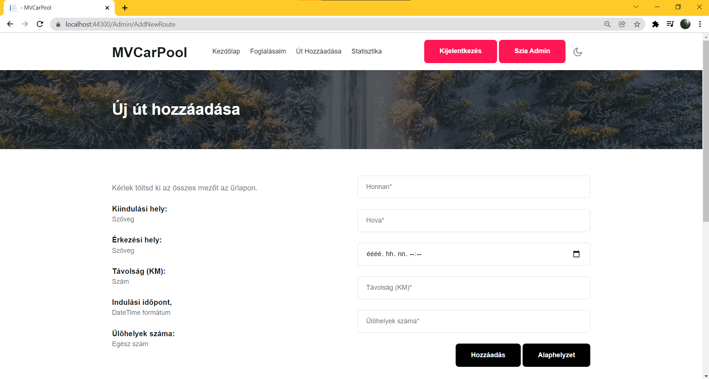
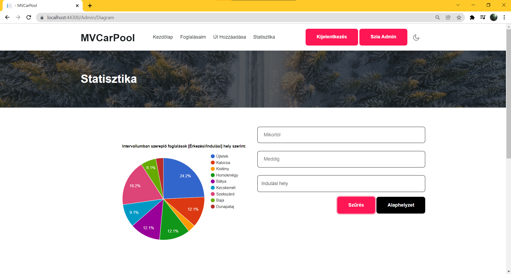
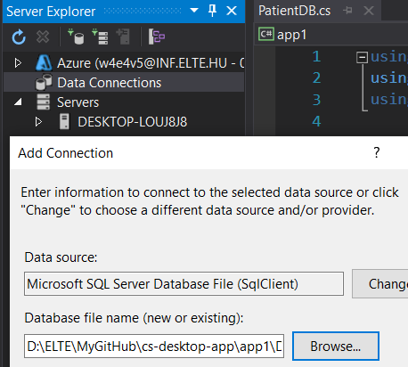
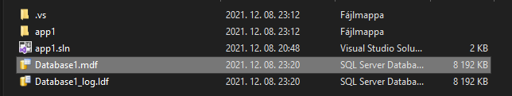
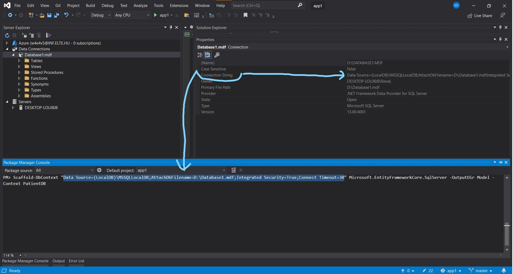
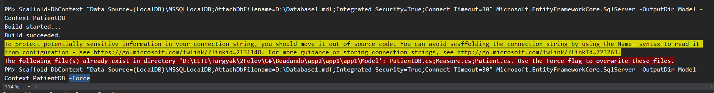

# Car-Sharing application ~ Hungarian 🚗🌍

## Introduction

This application was one of my university assignments, it's basically a car-sharing/car-pooling `MVC` application containing

- `Guest` functions
- `User` functions
- `Admin` functions

**Carpooling** (also car-sharing, ride-sharing and lift-sharing) is the sharing of car journeys so that **more than one person travels in a car**, and prevents the need for others to have to drive to a location themselves.

## Launching

- It's complex, I haven't figured out yet

- Data Connections - right click - Add Connection
- Browse the `Database1.mdf` (can be found in the project folder)
- Press <b>OK<b>

- Tools - NuGet Package Manager
- Package Manager Console
- `Scaffold-DbContext "here you paste the connection string" Microsoft.EntityFrameworkCore.SqlServer -OutputDir Model -Context PatientDB`
- Press Enter

- If red notification occurs, paste the command again with `-Force` at the end

- The program is connected to the database but will not work properly.

 
 
 